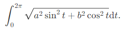
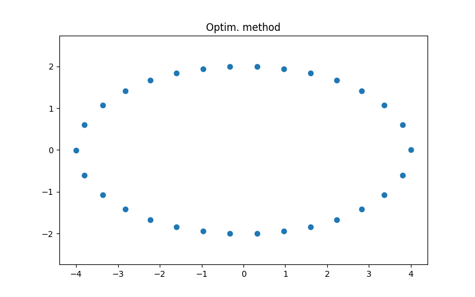

# Equal subdivision of an ellipse into N points
The program generates $N$ points on an ellipse with axes $(a, b)$, where the arc length between each point is identical.
The total arc length of the ellipse is solved (numerically) by the integral

Using the above, we split the task into $N$ optimization problems to find coordinates of each segment.
The program is reasonably fast and can easily generate more than $N = 1000$ points.


## Usage

```
python main.py [half-axis1 length] [half-axis2 length] [Npoints]
```

For example, to segment an ellipse with parameters $(a, b) = (4, 2)$ into $N = 30$ points:
```
python main.py 4 2 30
```

Producing the following ellipse:


